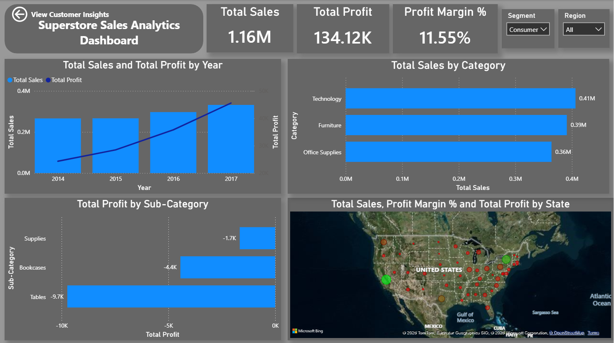
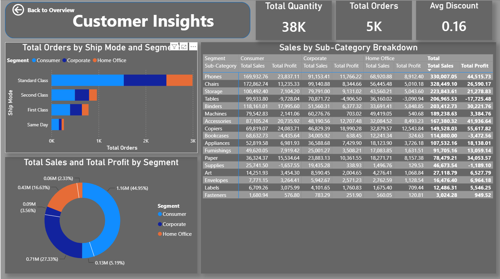

#  Superstore Sales & Profit Analysis: An End-to-End Data Science Project


##  Project Overview
This is a comprehensive, end-to-end Data Science and Business Intelligence project conducted on a retail database (**Superstore Giant**). The goal is to provide actionable business insights to understand sales trends, maximize profits, identify loss-making areas, and predict transaction profits using Machine Learning.

The analysis is divided into two core deliverables:
1. **Data Analytics & Predictive Modeling** (Python Jupyter Notebook)
2. **Advanced Business Intelligence Dashboard** (Two-Page Interactive Power BI Report)

---


##  Business Problem Definition
With growing demands and cut-throat competition in the retail market, the Superstore Giant needs to optimize its operations. This project answers critical business questions:
* Which products, regions, categories, and customer segments should they target or avoid?
* Why are certain regions or products causing heavy losses despite high sales?
* Can we build a predictive regression model to estimate profits before shipping?

---

##  Tech Stack & Tools
* **Data Processing & ML:** Python (`Pandas`, `NumPy`, `Scikit-Learn`)
* **Data Visualization:** `Matplotlib`, `Seaborn`
* **Business Intelligence:** Power BI (DAX, Power Query, Multi-Page Interactive Reporting, Page Navigation)

---

##  Project Pipeline

### 1. Data Cleaning & Understanding
* Analyzed a dataset of 9,994 transaction rows and 21 features.
* Handled encoding issues and missing values.
* Converted date strings into proper datetime formats to prepare for time-series and ML features.

### 2. Exploratory Data Analysis (EDA) - Key Insights
* **Top Performers:** Identified the Top 5 most profitable and top-selling products (e.g., *Canon imageCLASS 2200 Advanced Copier* takes the lead).
* **The "Central" Region Issue:** Discovered a critical business leak where certain high-volume products (like the *Fellowes PB500 Electric Punch*) incur massive losses in the Central region due to aggressive discounting strategies (up to 80%).

### 3. Machine Learning (Predictive Modeling)
* **Problem Type:** Regression (Predicting `Profit`).
* **Feature Engineering:** Extracted `Order Year` and `Order Month` from order dates.
* **Model:** Trained a **Random Forest Regressor** (80/20 train-test split).
* **Evaluation:** Evaluated performance using RMSE and R² Score to map feature importance for stakeholders.

---

##  Power BI Data Architecture & DAX Measures
To build a robust model, a dedicated **Time Dimension (Calendar Table)** was generated, and key metrics were implemented via DAX:

* **Total Sales:** `SUM('Sample - Superstore'[Sales])`
* **Total Profit:** `SUM('Sample - Superstore'[Profit])`
* **Profit Margin %:** `DIVIDE([Total Profit], [Total Sales], 0)`
* **Total Orders:** `DISTINCTCOUNT('Sample - Superstore'[Order ID])`

---

## Key Business Insights

### 1. Financial Performance (Overview Page)
* **Steady Growth:** Sales and profits exhibit a healthy upward trend from 2014 to 2017.
* **The Profit Leak:** The **Tables** sub-category incurs losses of nearly **-$9.7K**, making it the primary driver of profit loss.
* **Geographical Risk:** California and New York are profit engines, while Texas remains a deficit state.

### 2. Customer Operations (Customer Insights Page)
* **Segment Dominance:** The **Consumer** segment accounts for **45%** of total revenue.
* **Logistics:** **Standard Class** shipping is the preferred method for over 3K orders.
* **Matrix Analysis:** The profit leakage in *Tables* is consistent across all segments, indicating a flaw in pricing policy rather than customer type.

---

## Actionable Recommendations
1. **Optimize Discount Thresholds:** Audit and reduce aggressive discounts on *Tables* and *Bookcases*.
2. **Double Down on Winners:** Focus marketing on *Phones* and *Chairs* due to their stable high-profit yields.
3. **Audit Texas Market:** Investigate the local operations to replicate the success of California and New York.

---

## Dashboard Previews

### Page 1: Superstore Sales Analytics (Overview)
<p align="center">
  
</p>

### Page 2: Customer & Shipping Insights
<p align="center">
  
</p>

---

## Repository Structure
```text
├── Data/
│   └── Sample - Superstore.csv      
├── Notebooks/
│   └── data_science_project.ipynb   
├── Dashboards/
│   └── PowerBI_Dashboard.pbix       
└── README.md
